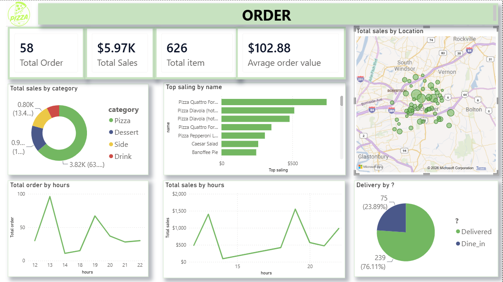
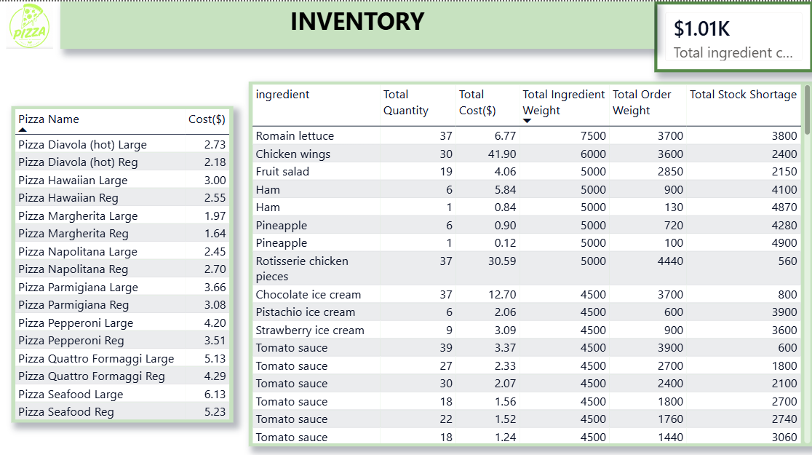
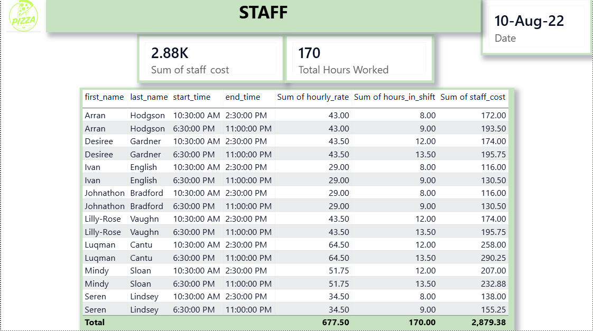

# 🍕 Pizza Restaurant Data Engineering & BI Dashboard Project

This project focuses on building an end-to-end data solution for a Pizza Restaurant, covering database design, data warehousing, SQL querying, and interactive Business Intelligence (BI) dashboarding. 

The goal of this project is to analyze **Orders**, **Inventory/Stock Shortages**, and **Staff Workload & Costs** to help the restaurant optimize operations and increase profitability.

---

## 🛠️ Tech Stack & Tools Used
- **Database Design:** QuickDBD (Quick Database Diagrams)
- **RDBMS:** MySQL
- **Database Management:** Navicat
- **Data Visualization & BI:** Power BI

---

## 🚀 Project Workflow & Steps

### 1. Database Design & Modeling (QuickDBD)
First, I designed the Relational Database Management System (RDBMS) schema using **QuickDBD** to establish relationships between tables such as Orders, Customers, Inventory, Ingredients, and Staff.
- Generated the Entity-Relationship Diagram (ERD).
- Exported the database schema as a `.sql` DDL script for MySQL.

### 2. Database Creation & Data Ingestion (MySQL & Navicat)
- Created the database in **MySQL**.
- Used **Navicat** to execute the generated DDL script and build the database structure.
- Imported raw data from `.csv` files into their respective MySQL tables using Navicat's Import Wizard.

### 3. Data Transformation & SQL Querying (Navicat)
To prepare the data for Power BI visualization, I wrote optimized SQL queries in Navicat to extract key metrics regarding total sales, ingredient costs, stock shortages, and staff shift costs.

Here are the core SQL queries used in this project:

#### Query 1: Comprehensive Order & Logistics Details

**Business Purpose:** This query consolidates individual order transactions with their corresponding menu item metrics (price, category, name) and delivery logistics (complete address, delivery type). It serves as the primary dataset for analyzing sales revenue, identifying top-selling items, mapping delivery locations, and calculating the Average Order Value (AOV).

```sql
SELECT
    o.order_id,
    i.item_price,
    o.quantity,
    i.item_cat,
    i.item_name,
    o.created_at,
    a.delivery_address1,
    a.delivery_address2,
    a.delivery_city,
    a.delivery_zipcode,
    o.delivery
FROM `order` AS o
LEFT JOIN item AS i
    ON o.item_id = i.item_id
LEFT JOIN address AS a
    ON o.add_id = a.add_id;
```

#### Query 2: Detailed Ingredient Utilization & Cost Calculation

**Business Purpose:** This query acts as the engine for the inventory dashboard. By breaking down each menu item into its core ingredients (via recipes) and multiplying it by total orders, it calculates the exact weight required for each ingredient. Furthermore, it determines the true financial cost of the ingredients used based on their purchase price and weight, helping the restaurant understand product margins and food cost percentage.

```sql
SELECT
    s1.item_name,
    s1.ing_id,
    s1.ing_name,
    s1.ing_weight,
    s1.ing_price,
    s1.order_quantity,
    s1.recipe_quantity,
    s1.order_quantity * s1.recipe_quantity AS order_weight,
    s1.ing_price / s1.ing_weight AS unit_cost,
    (s1.order_quantity * s1.recipe_quantity) *
    (s1.ing_price / s1.ing_weight) AS ingredient_cost
FROM (
    SELECT
        o.item_id,
        i.sku,
        i.item_name,
        r.ing_id,
        ing.ing_name,
        r.quantity AS recipe_quantity,
        SUM(o.quantity) AS order_quantity,
        SUM(o.quantity) * r.quantity AS ingredient_required,
        ing.ing_weight,
        ing.ing_price
    FROM `order` AS o
    LEFT JOIN item AS i
        ON o.item_id = i.item_id
    LEFT JOIN recipe AS r
        ON i.sku = r.recipe_id
    LEFT JOIN ingredient AS ing
        ON ing.ing_id = r.ing_id
    GROUP BY
        o.item_id,
        i.sku,
        i.item_name,
        r.ing_id,
        ing.ing_name,
        r.quantity,
        ing.ing_weight,
        ing.ing_price
) AS s1
ORDER BY
    s1.item_name,
    s1.ing_name;
```

#### Query 3: Inventory Stock Shortage & Remaining Weight Analysis

**Business Purpose:** This query is critical for supply chain and inventory management. It aggregates the total weight of ingredients required for all orders and compares it directly against the restaurant's current inventory stock weight. By calculating the `remaining_weight`, it instantly highlights which ingredients are running low or are in critical shortage (negative values), enabling the kitchen manager to make data-driven reordering decisions.

```sql
SELECT 
    s2.ing_name,
    s2.order_weight,
    ing.ing_weight * inv.quantity AS total_inv_weight,
    (ing.ing_weight * inv.quantity) - s2.order_weight AS remaining_weight
     
FROM (
    SELECT
        ing_id,
        ing_name,
        SUM(order_weight) AS order_weight
    FROM stock1
    GROUP BY
        ing_id,
        ing_name
) AS s2
LEFT JOIN inventory AS inv
    ON inv.item_id = s2.ing_id
LEFT JOIN ingredient AS ing 
    ON ing.ing_id = s2.ing_id;
```

#### Query 4: Staff Workload & Labor Cost Analysis

**Business Purpose:** This query calculates the operational hours and total labor costs for the restaurant staff based on the scheduling rota. By converting the difference between shift start and end times into decimal hours, it computes the exact cost incurred for each employee per shift. This data directly populates the Staff Dashboard to track metrics like "Total Hours Worked" (170 hours) and "Total Staff Cost" ($2.88K).

```sql
SELECT
    r.date,
    s.first_name,
    s.last_name,
    s.hourly_rate,
    sh.start_time,
    sh.end_time,
    TIMESTAMPDIFF(MINUTE, sh.start_time, sh.end_time) / 60 AS hours_in_shift,
    (TIMESTAMPDIFF(MINUTE, sh.start_time, sh.end_time) / 60) * s.hourly_rate AS staff_cost
FROM rota AS r
LEFT JOIN staff AS s
    ON r.staff_id = s.staff_id
LEFT JOIN shift AS sh
    ON r.shift_id = sh.shift_id;.
```

##  Data Integration & Power BI Reporting

After transforming and structuring the data with SQL, the next phase was to establish a live pipeline and build the visualization layer.

### 🔗 Database Connection (MySQL to Power BI)
- Connected **Power BI Desktop** directly to the local **MySQL database** using the native MySQL database connector.
- Imported the optimized SQL views created in Navicat (`Order Logistics`, `Ingredient Costs`, `Stock Shortages`, and `Staff Costs`) to ensure clean and pre-aggregated tables, significantly reducing the processing load inside Power BI.
- Configured the **Data Model (Relationship View)** within Power BI to ensure accurate cross-filtering and seamless interactions across all visuals and pages.

### 📊 Dashboard Development
I designed a comprehensive, 3-page interactive report tailored for restaurant managers and key stakeholders:

1. **Order Performance Page:** Developed to monitor daily sales operations. It utilizes KPI cards for high-level metrics (Total Orders, Total Sales, Average Order Value), a line chart for hourly sales trends to identify peak hours, a bar chart for top-selling items, and a map visual to pinpoint exact delivery locations.



2. **Inventory Control Page:** Created to minimize food waste and optimize supply chain management. This page tracks exact ingredient costs and highlights stock discrepancies. The "Total Stock Shortage" matrix allows managers to see precisely which ingredients (such as Romain lettuce or Chicken wings) need immediate replenishment.



3. **Staff & Labor Rota Page:** Built to optimize shift scheduling and manage labor budgets. It breaks down total hours worked against the hourly rates of each employee, providing a clear and actionable view of the restaurant's daily operational labor expenses.



.
## ⚙️ How to Run This Project
1. Clone this repository to your local machine.
2. Import the database schema and `.csv` datasets into your MySQL instance using Navicat or MySQL Workbench.
3. Open the Power BI file (`.pbix`) and update the data source settings to connect to your local MySQL server.

---

## 📬 Contact & Connect
If you have any questions, feedback, or would like to discuss this project further, feel free to reach out!

- **LinkedIn:** [https://www.linkedin.com/in/hastiattar/)
- **Email:** [Hkazemattar@gmail.com]
- **GitHub:** [https://github.com/Hastiattar)

